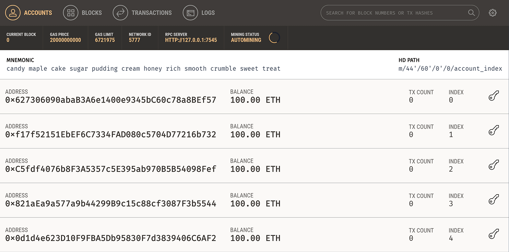
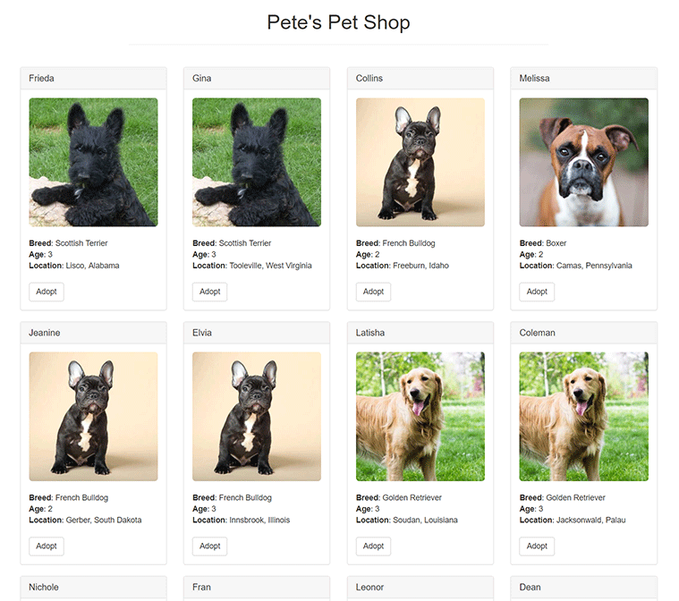
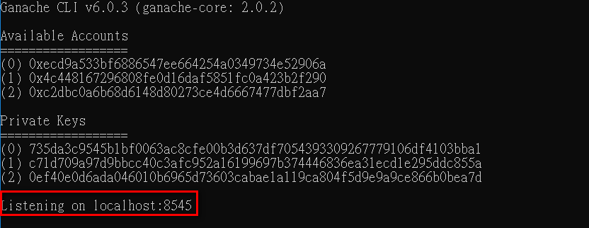
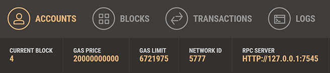

# pet_shop_tutorial

This tutorial will take you through the process of building your first dapp—an adoption tracking system for a pet shop!

This tutorial is meant for those with a basic knowledge of Ethereum and smart contracts, who have some knowledge of HTML and JavaScript, but who are new to dapps.

## Source: http://truffleframework.com/tutorials/pet-shop

# Step :

## 1. donwload source code from this repository

## 2. install package

        npm install

## 3. execute ganache 

## 4. open terminal (Mac) or command line (windows) ,make sure you are in the root of the directory that contains the dapp and type:

        truffle compile

## 5. Back in terminal or command line, migrate the contract to the blockchain.

        truffle migrate

## 6 Using the dapp, Start the local web server:

        npm run dev

## PS : Please check that your Ethereum client and the port in truffle.js are the same if it can not connect to your Ethereum client. 

### ganache-cli

### ganache
